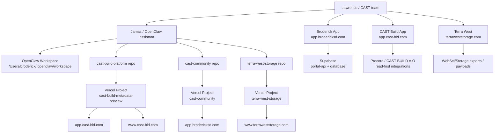
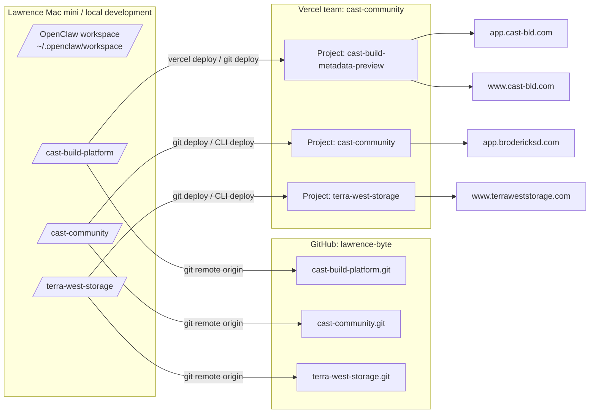
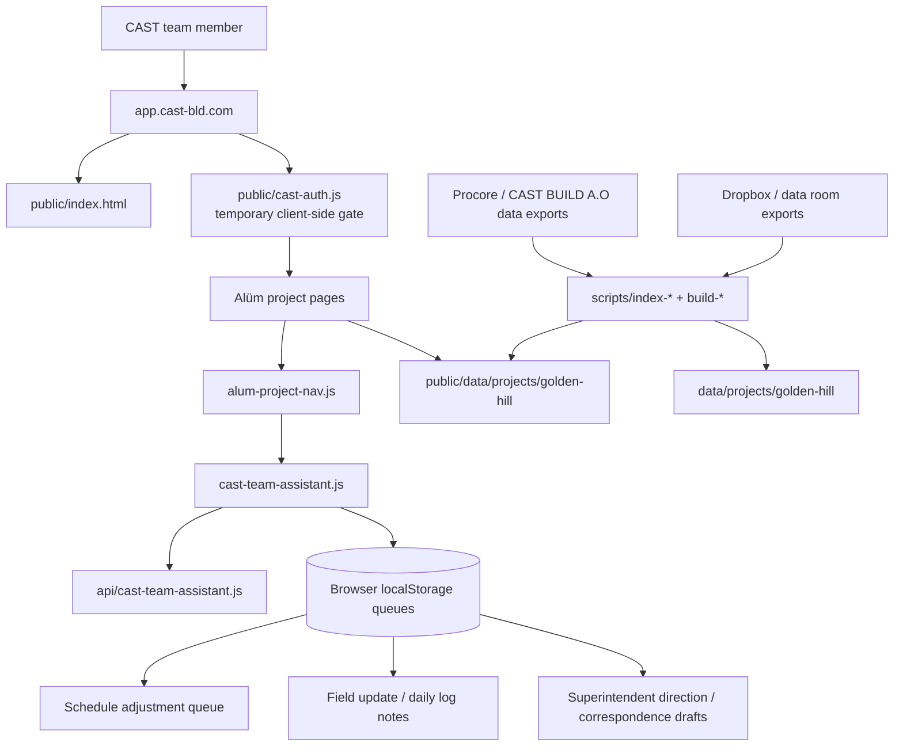
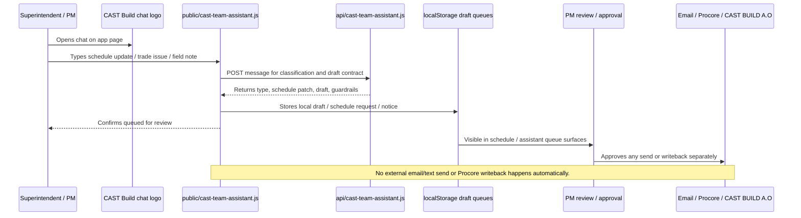
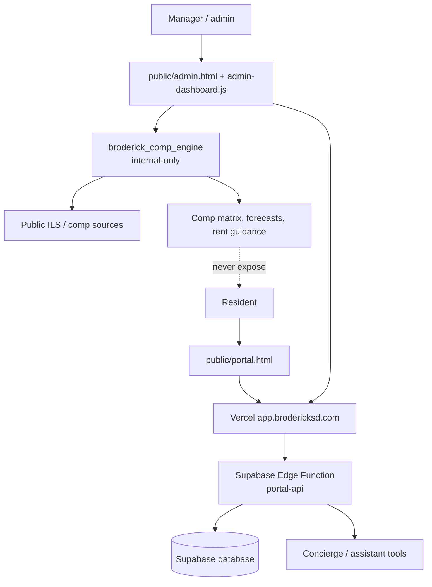
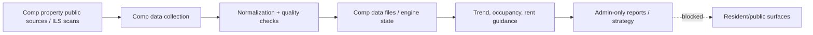
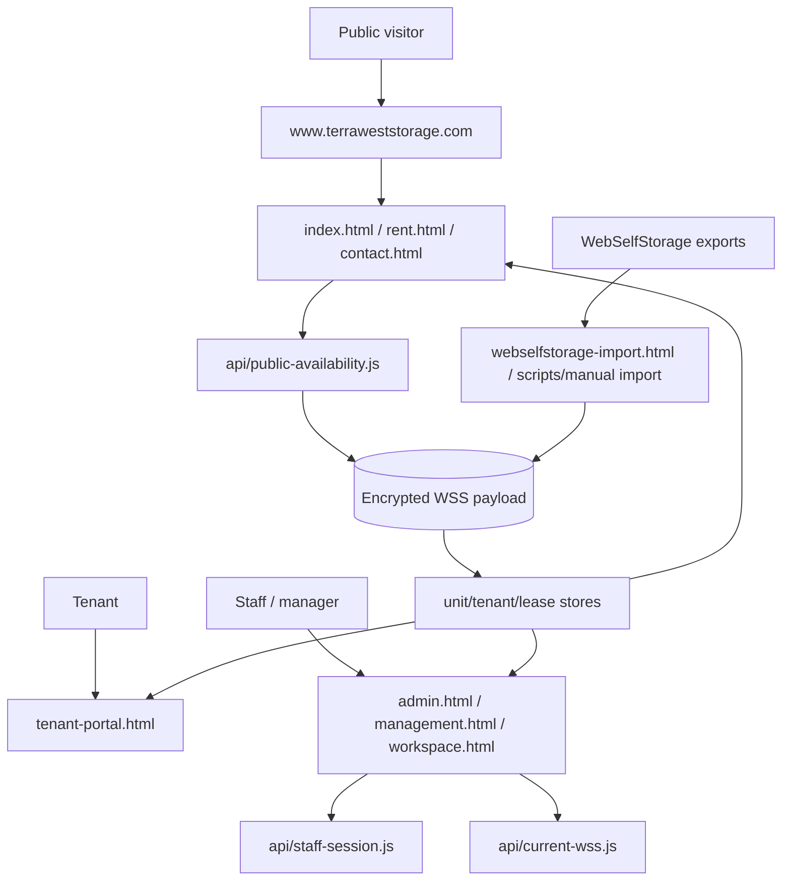
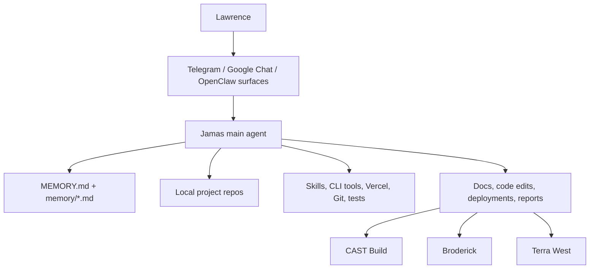
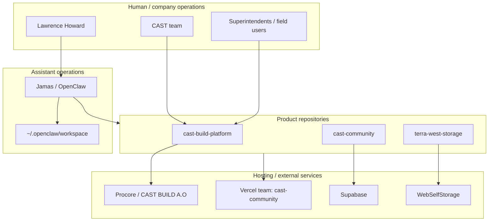

# CAST / Broderick / Terra West Platform Architecture and Code Map

_Last verified locally: 2026-05-11_

This document explains where the current CAST-related platforms live, where the code is stored, how the major parts flow together, and what is safe vs. still prototype-only.

It covers:

- CAST Build app / construction management platform
- Broderick resident + management platform
- Broderick competitive market intelligence engine
- Terra West Self Storage public/tenant/admin platform
- Jamas / OpenClaw assistant workspace and supporting automations

> Important: this is an architecture map, not a security certification. Several surfaces are intentionally static/prototype or approval-gated and should not be treated as fully production-authenticated until the noted backend/auth work is completed.

---

## 1. Executive platform map

| Platform | Live location | Code location | GitHub remote | Primary purpose | Current maturity |
|---|---|---|---|---|---|
| CAST Build App | `https://app.cast-bld.com` | `/Users/broderick/Documents/GitHub/cast-build-platform` | `https://github.com/lawrence-byte/cast-build-platform.git` | CAST construction-management operating layer; Alüm project workspace; document, schedule, budget, RFI/submittal, assistant workflows | Static/Vercel app with temporary client-side auth and approval-gated assistant workflows |
| CAST Build Website | `https://www.cast-bld.com` | Same repo currently aliases to the same Vercel project | Same as CAST Build App | Public/company-facing CAST Build web presence | Currently shares deployment/project aliasing with app; should be separated if marketing site and app need different experiences |
| Broderick Resident + Management Platform | `https://app.brodericksd.com` | `/Users/broderick/Documents/GitHub/cast-community` | `https://github.com/lawrence-byte/cast-community.git` | Resident portal, admin portal, concierge, community operations | Live Vercel/Supabase-backed app, but auth/tenant-isolation hardening remains critical |
| Broderick Competitive Market Intelligence | Internal only; no public URL | `/Users/broderick/Documents/GitHub/cast-community/broderick_comp_engine` | Inside `cast-community` repo | Admin-only comp tracking, occupancy/rent intelligence, leasing strategy | Internal data/intelligence engine; never expose to resident/public pages |
| Terra West Self Storage | `https://www.terraweststorage.com` | `/Users/broderick/Documents/GitHub/terra-west-storage` | `https://github.com/lawrence-byte/terra-west-storage.git` | Public storage site, rental/reservation flow, tenant portal, staff/admin support surfaces | Vercel static app with API helpers and encrypted private payloads; payment/e-sign/gate-code automation not fully live |
| Jamas / OpenClaw workspace | Local assistant workspace | `/Users/broderick/.openclaw/workspace` | Local workspace, not a product repo | Assistant memory, project notes, skills, orchestration, local docs | Operational support layer; not customer-facing |

---

## 2. Portfolio-level architecture



---

## 3. Code storage and deployment flow



---

## 4. CAST Build App

### 4.1 Live locations

- App: `https://app.cast-bld.com`
- Current Vercel project name: `cast-build-metadata-preview`
- Current Vercel team slug: `cast-community`
- Additional aliases currently observed on the same Vercel deployment:
  - `https://www.cast-bld.com`
  - `https://cast-build-metadata-preview.vercel.app`
  - `https://cast-build-metadata-preview-cast-community.vercel.app`

### 4.2 Code locations

- Local repo: `/Users/broderick/Documents/GitHub/cast-build-platform`
- GitHub remote: `https://github.com/lawrence-byte/cast-build-platform.git`
- Vercel config: `.vercel/repo.json`
- Key package scripts:
  - `npm test`
  - `npm run build`
  - `npm run intake:*` scripts for indexing project data
  - `npm run schedule:brain`

### 4.3 Important files and folders

| Area | Files / folders | Purpose |
|---|---|---|
| Landing and shell | `public/index.html`, `public/cast-build.css`, `public/cast-build-components.css`, `public/cast-build-shell.js` | App landing, brand system, static shell |
| Temporary auth | `public/cast-auth.js` | Client-side team sign-in gate. Temporary only; not a backend security boundary |
| Team assistant | `public/cast-team-assistant.js`, `api/cast-team-assistant.js` | Chat/field intake, schedule update queueing, correspondence/superintendent direction drafts |
| Alüm project nav | `public/projects/alum-project-nav.js` | Shared Alüm project navigation and assistant loading |
| Schedule | `public/projects/alum-schedule.html`, `public/projects/alum-schedule.js` | Schedule view, field updates, assistant queue |
| Project controls | `public/projects/alum-rfis.*`, `alum-submittals.*`, `alum-change-events.*`, `alum-budget*`, `alum-commitments.*`, etc. | Construction-management modules |
| Document intake | `api/document-intake.js`, `api/_lib/document-intake-api.js`, `public/cast-document-intake.js`, `public/admin-document-intake.js` | Local/admin document review, filing, and intake queue concepts |
| Data | `data/projects/golden-hill/**`, `public/data/projects/golden-hill/**` | Generated/static project data for Alüm / Golden Hill |
| Build scripts | `scripts/build-static.js`, `scripts/index-*.js`, `scripts/build-*.js` | Static build and data indexing |
| Tests | `tests/static-platform-audit.js`, `tests/*unit-tests.js`, `tests/document-intake-api-tests.js` | Static guardrail and feature regression checks |
| Docs | `docs/*.md` | Platform map, Procore plan, guardrails, schedule/document intelligence notes |

### 4.4 CAST Build app flow



### 4.5 CAST Build assistant flow



### 4.6 Current CAST Build guardrails

- Temporary shared-password account gate exists, but it is client-side only.
- Assistant can classify and queue:
  - schedule updates
  - field updates
  - behind-trade/recovery notices
  - correspondence drafts
  - coordination notes
- Assistant/API signals explicitly keep:
  - `externalWriteback: false`
  - `externalSend: false`
  - `approvalRequired: true`
- No Procore/CAST BUILD A.O writes should happen without explicit Lawrence approval.
- No commitments, approvals, spend, contract changes, legal/HR-sensitive actions, credential/access changes, or destructive actions should be automated.

---

## 5. Broderick Resident + Management Platform

### 5.1 Live locations

- Main app: `https://app.brodericksd.com`
- Resident portal: `https://app.brodericksd.com/portal.html`
- Admin portal: `https://app.brodericksd.com/admin.html`
- Vercel project name: `cast-community`
- Vercel team slug: `cast-community`

### 5.2 Code locations

- Local repo: `/Users/broderick/Documents/GitHub/cast-community`
- GitHub remote: `https://github.com/lawrence-byte/cast-community.git`
- Vercel config: `.vercel/repo.json`
- Supabase project artifacts exist under:
  - `supabase/functions/portal-api/`
  - `supabase/migrations/`
  - `supabase/.temp/` local linked-project metadata

### 5.3 Important files and folders

| Area | Files / folders | Purpose |
|---|---|---|
| Live static frontend | `public/index.html`, `public/portal.html`, `public/admin.html`, `public/admin-dashboard.js` | Current Vercel public/admin source-of-truth pages |
| Concierge/admin widget | `public/concierge-widget-admin.js` | Admin concierge surface |
| Styles/assets | `public/cast-styles.css`, `public/broderick-*` assets | Broderick branding and UI assets |
| Intended backend/server | `src/server.ts`, `src/agent.ts` | TypeScript server/agent code |
| Supabase Edge Function | `supabase/functions/portal-api/index.ts`, `data.ts`, `tools.ts`, `concierge.ts` | Portal API and concierge logic |
| Database migrations | `supabase/migrations/*.sql` | RLS/security/schema migrations |
| Competitive engine | `broderick_comp_engine/` | Internal-only comp/rent/occupancy intelligence |
| Tests | `tests/*.js` | Platform, security, comp engine, live smoke, parity tests |
| Docs | `docs/broderick-deployment-map.md`, `docs/resident-security-audit-2026-04-23.md`, etc. | Deployment and security posture notes |

### 5.4 Broderick platform flow



### 5.5 Broderick security notes

- Treat `public/portal.html`, `public/admin.html`, and `public/admin-dashboard.js` as the current live/static source of truth.
- Root-level `portal.html` / `admin.html` are legacy/alternate unless deployment config changes.
- Do not treat the live resident platform as production-safe until auth and tenant isolation are fully verified.
- Prior audit concern: live Supabase `portal-api` behavior previously allowed auth bypasses or null resident-bound writes. The repo now has `supabase/functions/portal-api`, but deployed/source parity still needs to remain a standing check.
- Competitive intelligence must remain admin/management-only and must not leak into resident/public surfaces.

---

## 6. Broderick Competitive Market Intelligence Engine

### 6.1 Code location

- Local path: `/Users/broderick/Documents/GitHub/cast-community/broderick_comp_engine`
- Stored inside the `cast-community` GitHub repo.

### 6.2 Purpose

The comp engine tracks comparable multifamily assets for Broderick and supports management decisions around:

- competitor availability
- occupancy
- pricing
- concessions
- rent strategy
- leasing forecasts
- weekly/internal reporting

### 6.3 Intelligence flow



### 6.4 Guardrail

This is proprietary management intelligence. Never expose comp matrices, rent strategy, weekly leasing memos, forecasts, or proprietary competitive data to public/resident pages.

---

## 7. Terra West Self Storage Platform

### 7.1 Live locations

- Public site: `https://www.terraweststorage.com`
- Vercel project name: `terra-west-storage`
- Vercel team slug: `cast-community`

### 7.2 Code locations

- Local repo: `/Users/broderick/Documents/GitHub/terra-west-storage`
- GitHub remote: `https://github.com/lawrence-byte/terra-west-storage.git`
- Vercel config: `.vercel/project.json`

### 7.3 Important files and folders

| Area | Files / folders | Purpose |
|---|---|---|
| Public pages | `index.html`, `rent.html`, `contact.html`, `why-terra-west.html` | Public marketing and rental/reservation entry |
| Tenant/staff/admin surfaces | `tenant-portal.html`, `admin.html`, `management.html`, `workspace.html`, `webselfstorage-import.html` | Tenant portal, staff/management/demo tools |
| API helpers | `api/_auth.js`, `api/current-wss.js`, `api/public-availability.js`, `api/staff-session.js` | Serverless helpers for staff/session/public availability |
| Runtime/data model | `unit-store.js`, `tenant-store.js`, `lease-store.js`, `delinquency-engine.js`, `forecast-engine.js`, `insights-engine.js`, `terra-west-runtime.js` | Browser/static data model and storage-business logic |
| Private encrypted payload | `private-data/webselfstorage-current.enc.json` | Encrypted WebSelfStorage-derived current data |
| Security/deployment | `vercel.json`, `.vercelignore`, `robots.txt`, `sitemap.xml` | Routing, headers, SEO/noindex controls |
| Tests | `tests/*.mjs` | Static audit, launch hardening, staff session, WebSelfStorage reconciliation |
| Docs | `LAUNCH_CHECKLIST.md`, `CODEX_AUDIT_NOTES.md`, `CLAUDE_STRUCTURAL_REVIEW.md`, `TERRA_WEST_*` docs | Readiness, operational setup, audit notes |

### 7.4 Terra West flow



### 7.5 Terra West guardrails

- Public/internal routes are exposure-hardened, not equivalent to a full authenticated backend.
- Real payment processing is not fully connected.
- Real e-signature provider is not fully connected.
- Real automatic gate/access-code provisioning is not fully connected.
- Until those providers are connected, user-facing copy should stay in request/reservation/handoff mode rather than claiming complete automated online move-in.

---

## 8. Jamas / OpenClaw assistant workspace

### 8.1 Location

- Workspace root: `/Users/broderick/.openclaw/workspace`

### 8.2 Purpose

This is the assistant operating workspace. It is not a public product repo. It stores:

- assistant identity/persona files
- long-term memory and daily notes
- project map
- local tooling notes
- skills and scratch exports
- generated documents that are not necessarily part of a product repo

### 8.3 Key files

| File | Purpose |
|---|---|
| `AGENTS.md` | Workspace operating rules |
| `SOUL.md` | Assistant tone/persona guidance |
| `IDENTITY.md` | Assistant identity metadata |
| `USER.md` | Lawrence-specific user context |
| `MEMORY.md` | Curated long-term memory |
| `PROJECTS.md` | Durable project map |
| `TOOLS.md` | Local tools and environment notes |
| `HEARTBEAT.md` | Proactive/heartbeat checklist |

### 8.4 Assistant operational flow



---

## 9. Environment and ownership diagram



---

## 10. Deployment commands and verification gates

### CAST Build

Repo:

```bash
cd /Users/broderick/Documents/GitHub/cast-build-platform
```

Verify:

```bash
npm test
npm run build
```

Deploy production to app alias:

```bash
vercel deploy . --prod -y --scope cast-community
```

Inspect app deployment:

```bash
vercel inspect https://app.cast-bld.com --scope cast-community
```

### Broderick

Repo:

```bash
cd /Users/broderick/Documents/GitHub/cast-community
```

Typical verification depends on the touched area, but common gates include:

```bash
npm test
npm run build
npm run test:security:static
npm run audit:comp:live
```

Supabase Edge Function deploy script exists:

```bash
npm run deploy:portal-api
```

Use only with explicit approval when touching live backend behavior.

### Terra West

Repo:

```bash
cd /Users/broderick/Documents/GitHub/terra-west-storage
```

Common verification:

```bash
node tests/static-site-audit.mjs
node tests/launch-hardening.mjs
node tests/staff-session-api-test.mjs
node tests/webselfstorage-reconciliation-test.mjs
```

Deploy path depends on current Vercel/Git setup and production env readiness.

---

## 11. Current local working-tree caution

At the time this document was generated, the CAST Build repo had many uncommitted changes from recent app/auth/assistant/logo/document-intelligence work. Terra West also had a small set of uncommitted changes. Before making a formal release branch, commit, or handoff package, run:

```bash
git status --short
```

in each repo and separate unrelated changes into clear commits.

Recommended commit grouping for CAST Build:

1. Brand/logo and landing-page UI changes
2. Chat assistant + superintendent direction workflow
3. Temporary auth gate/account scaffold
4. Document-intelligence data sanitization and build script updates
5. Architecture documentation

---

## 12. Recommended next architecture steps

### CAST Build

1. Split `app.cast-bld.com` and `www.cast-bld.com` into distinct products if the marketing website should differ from the app.
2. Replace client-side shared-password auth with real server-side identity/auth.
3. Add project/user/role permissions before exposing sensitive project data broadly.
4. Move assistant queues from localStorage to a backend queue/table with audit history.
5. Keep Procore/CAST BUILD A.O writeback disabled until role-based approval and audit logging exist.

### Broderick

1. Keep deployed Supabase `portal-api` source and local repo source in parity.
2. Continue auth and tenant-isolation regression checks.
3. Keep comp engine outputs admin-only.

### Terra West

1. Keep public rental flow honest as reservation/handoff until payment/e-sign/access-code systems are fully connected.
2. Preserve encrypted/private payload handling for WebSelfStorage-derived data.
3. Do not expose staff/admin/demo surfaces as if they were production-authenticated until real auth exists.

---

## 13. Quick reference: repo paths

```text
/Users/broderick/Documents/GitHub/cast-build-platform
/Users/broderick/Documents/GitHub/cast-community
/Users/broderick/Documents/GitHub/cast-community/broderick_comp_engine
/Users/broderick/Documents/GitHub/terra-west-storage
/Users/broderick/.openclaw/workspace
```

## 14. Quick reference: live URLs

```text
https://app.cast-bld.com
https://www.cast-bld.com
https://app.brodericksd.com
https://www.terraweststorage.com
```
